# Storage Strategy

> 定义**整个应用的数据存储架构**，以后即使底层从 Cloudflare 换成 AWS、Redis、Postgres，也基本不用改设计。

**One Source of Truth. Multiple Storage Layers.**

所有业务数据最终保存在 Primary Database，根据不同的数据访问模式，通过 KV、Durable Objects 等存储层进行加速，而不是将它们作为主数据库。

> **Source of Truth 的本质是 Primary Database，而不是某个具体产品。**
>
> ```text
> 当前实现：Primary Database = D1
> 未来演进：Primary Database = PostgreSQL / MySQL / ...
> ```

---

# 1. 设计原则

整个系统遵循以下原则：

1. **Primary Database 是唯一可信数据源（Source of Truth）**，所有业务数据最终持久化到 Primary Database。
2. **KV 仅承担缓存职责**，用于加速读多写少的数据访问，不保存业务状态。
3. **Durable Objects 仅承担状态聚合职责**，负责处理高并发、高一致性的读写场景，并以增量（Delta）方式同步到 Primary Database。
4. **业务按数据访问模式设计，而不是按底层存储产品设计**。业务代码依赖统一的 Storage 抽象，而不是直接操作 KV、D1 或 Durable Objects。
5. **缓存可以失效，状态可以重建，但 Primary Database 永远是最终恢复来源。**

因此，业务代码无需关心底层是 KV、D1 还是 Durable Objects，而只需要关心：

```text
读取    →  从哪里读最快
修改    →  写入后是否需要缓存/聚合
统计    →  是否高频写入，需要增量同步
缓存    →  是否值得缓存，缓存策略是什么
```

由 Storage Provider 自动选择最适合的数据层。

---

# 2. 总体架构

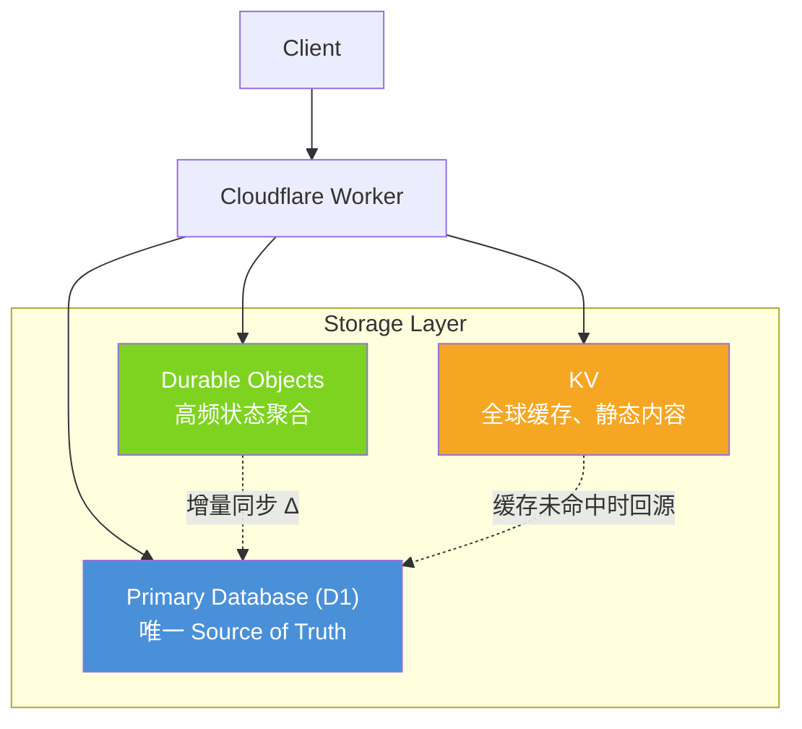

| 存储层           | 职责                               | 数据持久化         | 角色            |
| ---------------- | ---------------------------------- | ------------------ | --------------- |
| KV               | 全球缓存、静态内容                 | 是（缓存性质）     | 可重建缓存      |
| Durable Objects  | 高频状态聚合、原子计数器           | 是（对象级持久化） | 状态聚合层      |
| Primary Database | 永久业务数据、唯一 Source of Truth | 是（最终持久化）   | Source of Truth |

> 虽然 Durable Objects 具备持久化能力，但本架构中仅将其作为状态聚合层使用，最终业务数据仍以 Primary Database 为准。

---

# 3. 存储选择决策

新增功能时，**不要先想"用哪个存储"**，而应该先分析数据的访问模式。

## 决策流程图

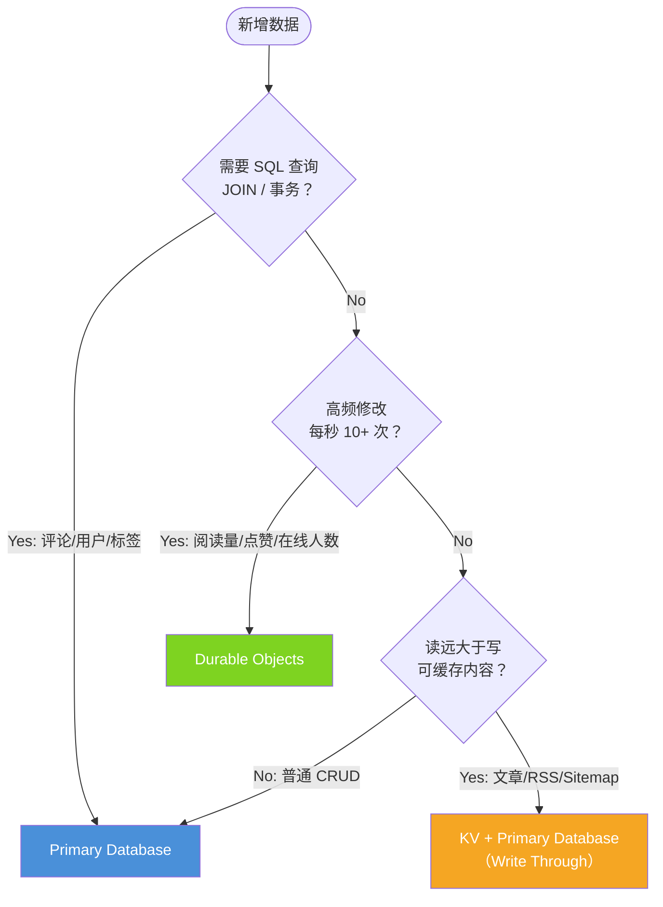

## 决策表

| 问题                             | 是               | 否               |
| -------------------------------- | ---------------- | ---------------- |
| 是否需要 SQL 查询、JOIN、事务？  | Primary Database | ↓                |
| 是否属于高频读写、需要原子更新？ | Durable Objects  | ↓                |
| 是否属于读多写少、可缓存内容？   | KV               | ↓                |
| 其他                             | Primary Database | Primary Database |

---

# 4. 数据访问模式

所有数据最终都会落到 Primary Database，KV 与 Durable Objects 都不是最终数据库。

---

## Pattern 1：Direct Database Access — 直连 Primary Database

**特点：** 读取频率低、修改频率低、不需要缓存。

**数据流：**


**典型数据：** 后台管理、用户资料、系统配置、权限、后台 CRUD。

**特点：** 永远直接访问 Primary Database，不经过 KV，不经过 DO。

---

## Pattern 2：Cached Content — Read Through + Write Through

**特点：** 经常读取、很少修改。

**数据流 — 写入（Publish）：**

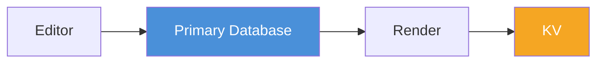

**数据流 — 读取：**

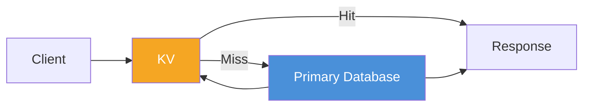

**缓存模式：**

| 操作 | 模式          | 说明                                          |
| ---- | ------------- | --------------------------------------------- |
| 读   | Read Through  | 先查 KV，miss 时查 Primary Database 并回填 KV |
| 写   | Write Through | 写入 Primary Database 后立即渲染 并写入 KV    |

> **注意：** 不是 Cache Aside（旁路缓存）。Cache Aside 的写策略是"先写库再删缓存"，而本项目是"写库后立即重新生成并写入 KV"，保证更新立即生效，不存在"一分钟旧缓存"。

**KV 版本化 Key 策略：**

```text
article:hello:v42       ← 实际内容
article:hello:latest    → v42（指针）
```

好处：

- 更新时原子切换，不需要先 delete 再 put
- CDN 缓存天然失效（新 Key = 新 URL）
- 支持回滚到任意历史版本

> 这在静态站点里非常常见。

**Cache TTL 策略：**

| 数据          | TTL    | 说明               |
| ------------- | ------ | ------------------ |
| HTML          | 1h     | 文章渲染结果       |
| RSS           | 10min  | 频繁更新的订阅源   |
| Sitemap       | 1h     | SEO 数据，低频变化 |
| Article List  | 5min   | 列表页，适度缓存   |
| Search Result | 不缓存 | 实时性要求高       |

> 没有明确 TTL 策略的 KV Key，以后每个人理解不同。**所有 KV Key 都必须有明确的 TTL。**

**典型数据：** Markdown、HTML、RSS、Sitemap、Front Matter。

> **注意：** 分类和标签**不应放 KV**。博客场景下分类 20 个、标签 50 个，查询成本极低，放 Primary Database 即可。只有真正有缓存价值的数据（KB~MB 级）才值得走 KV。

---

## Pattern 3：Aggregated Counters — Counter Aggregation

**特点：** 高频读取、高频修改、需要保证一致性。

**数据流：**

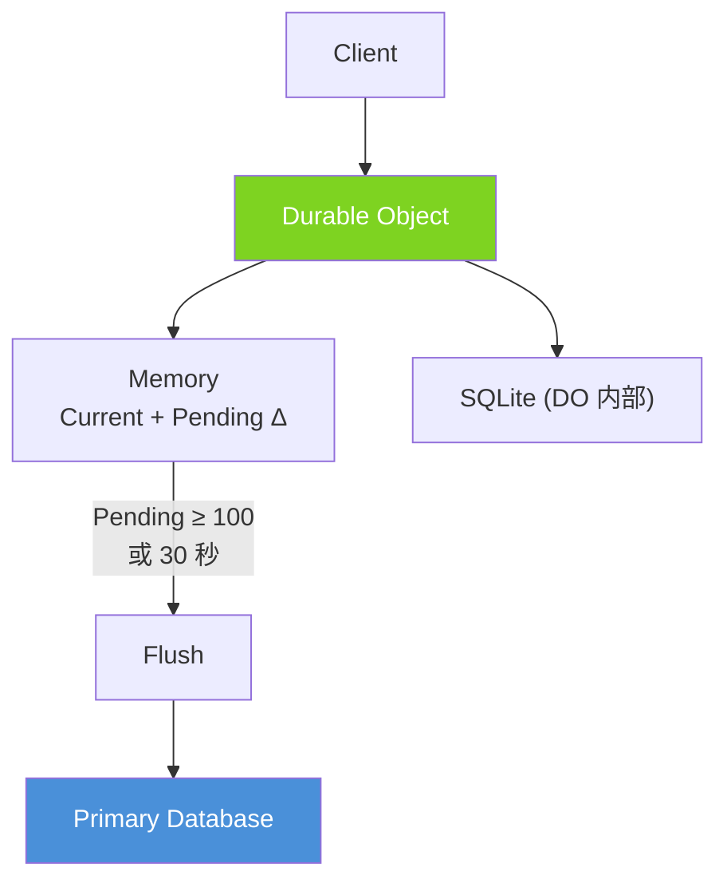

**DO 内维护的模型：**

```text
Current Count   = 当前展示值（如 100000）
Pending Delta   = 待同步增量（如 23）
```

**工作机制：**

1. 收到请求 → `Pending++`, `Current++`
2. 当 `Pending ≥ 100` 或 **30 秒**超时 → 执行 Flush
3. `UPDATE article_stats SET views = views + Pending`
4. 同步成功 → `Pending = 0`

```ts
// 设置 Alarm 作为兜底触发器
await this.storage.setAlarm(Date.now() + 30_000);
```

- **有请求时：** 按阈值（Pending ≥ 100）触发 flush
- **无请求时：** 由 Alarm 触发 flush，避免低流量文章永远不落库
- **两者配合：** 保证数据最终一致性

**关键原则：永远同步增量（Delta），不要覆盖写入。**

```sql
-- ✅ 正确：增量同步
UPDATE article_stats SET views = views + :delta

-- ❌ 错误：覆盖写入（多实例 flush 时会丢失增量）
UPDATE article_stats SET views = :absolute_value
```

**典型数据：** 阅读量、点赞、收藏、在线人数。

---

## Pattern 4：Immutable Append Log — 直接 INSERT

**特点：** 基本没有 Update，永远 INSERT。

**数据流：**


**评论统计（派生数据）：**

评论数量属于**派生数据（Derived Data）**，来源永远是 `comments` 表，而不是 counter：

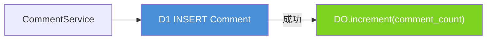

> **为什么不用 DO 作为评论数量的 source？**
>
> 评论内容和评论数量分别写入时，存在不一致窗口：
>
> - 评论 INSERT 成功，DO++ 失败 → 实际 11 条，显示 10
> - DO++ 成功，评论 INSERT 失败 → 显示 11，实际 10
>
> 正确做法：**先 INSERT 评论，成功后再 increment counter**。评论数量随时可以从 `comments` 表重建。

**典型数据：** 评论内容、日志、操作记录、通知。

---

# 5. 存储模式总结

| 模式                 | 数据流                                 | 场景          | 对应 Pattern |
| -------------------- | -------------------------------------- | ------------- | ------------ |
| Direct Database      | Client → Primary Database              | 后台、CRUD    | Pattern 1    |
| Read Through         | Client → KV → Primary Database（miss） | 读取文章、RSS | Pattern 2    |
| Write Through        | Primary Database → KV                  | 发布文章      | Pattern 2    |
| Counter Aggregation  | Client → DO → Primary Database         | 阅读量、点赞  | Pattern 3    |
| Immutable Append Log | Client → Primary Database INSERT       | 评论、日志    | Pattern 4    |

> **这套模式不绑定任何云平台。** 以后即使把 Primary Database 换成 PostgreSQL、KV 换成 Redis、DO 换成 Redis Streams 或 Actor Model，这套模式依然成立。设计已经抽象到了架构层，而不是绑定某个云平台。

---

# 6. 插件架构与依赖注入

业务代码不直接操作 KV / D1 / DO，而是通过 Honest DI 框架注入存储服务。底层驱动由插件在启动时自动探测并注册。

## 架构总览

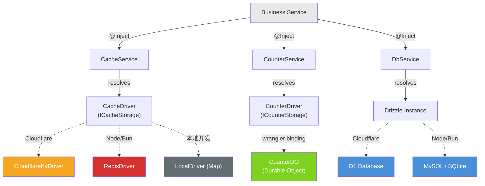

## 存储服务注入方式

三个存储服务均通过 `ComponentManager` 全局注册，业务层用 `@Inject()` 注入：

```ts
// CacheService — 缓存读写（Pattern 2）
// packages/honest-plugins/cache/src/cache-service.ts
@Service()
class CacheService {
  constructor() {
    return ComponentManager.getPlugin<CacheDriver>(COUNTER_GLOBAL_KEY);
  }
}
interface CacheService extends CacheDriver {}

// CounterService — DO 计数器（Pattern 3）
// packages/honest-plugins/counter/src/counter-service.ts
@Service()
class CounterService {
  constructor() {
    return ComponentManager.getPlugin<CounterDriver>(COUNTER_GLOBAL_KEY);
  }
}
interface CounterService extends CounterDriver {}

// DbService — Primary Database（Pattern 1/4）
// packages/honest-plugins/db/src/db-service.ts
@Service()
class DbService {
  constructor() {
    return ComponentManager.getPlugin<BaseSQLiteDatabase>(GLOBAL_KEY);
  }
}
interface DbService extends BaseSQLiteDatabase {}
```

> 通过接口合并（`interface X extends Y`），注入后的类型自动暴露所有驱动方法，业务代码完全不知道底层是什么。

## 缓存驱动自动探测

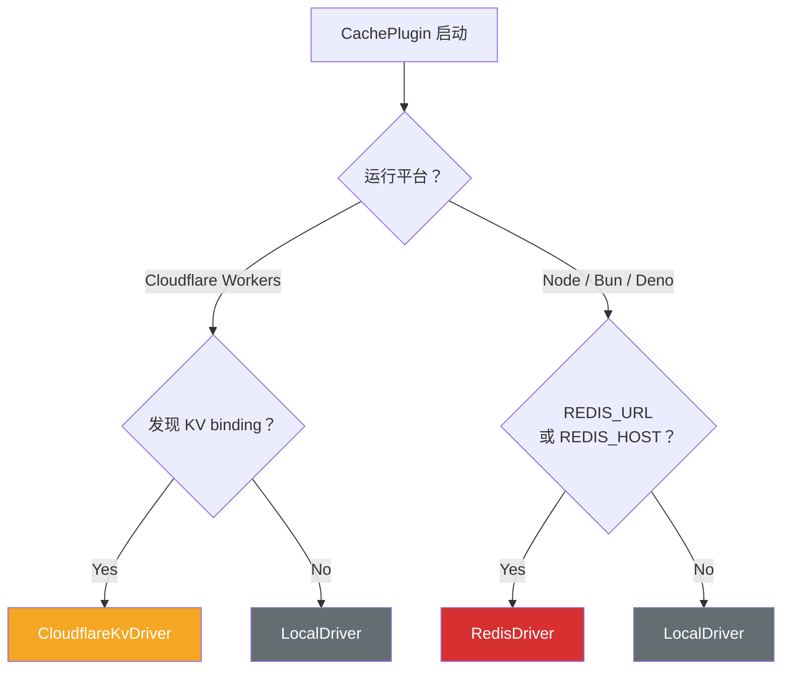

对应代码 `packages/honest-plugins/cache/src/resolve.ts`：

```ts
if (isCloudflarePlatform(env)) {
  const binding = findKvBinding(env);
  return new CloudflareKvDriver(binding);
}
if (process.env.REDIS_URL || process.env.REDIS_HOST) {
  return new RedisDriver({ url: process.env.REDIS_URL });
}
return new LocalDriver(); // 内存 Map，仅用于本地开发
```

## Wrangler Bindings 配置

`wrangler.jsonc` 声明所有运行时绑定：

| Binding      | 类型           | 用途             |
| ------------ | -------------- | ---------------- |
| `DB`         | D1 数据库      | Primary Database |
| `KV_BINDING` | KV 命名空间    | 全球缓存         |
| `COUNTER_DO` | Durable Object | 高频计数器聚合   |

```jsonc
// wrangler.jsonc（摘要）
{
  "d1_databases": [{ "binding": "DB", "database_name": "db" }],
  "kv_namespaces": [{ "binding": "KV_BINDING", "id": "b165d3a2..." }],
  "durable_objects": {
    "bindings": [{ "name": "COUNTER_DO", "class_name": "CounterDO" }],
  },
  "migrations": [{ "tag": "v1", "new_classes": ["CounterDO"] }],
}
```

## read-through 缓存工具

`cacheable()` 是封装好的 read-through 缓存辅助函数：

```ts
// packages/honest-plugins/cache/src/cacheable.ts
async function cacheable<T>(
  cache: CacheDriver,
  key: string,
  ttl: number,
  fetch: () => Promise<T>,
): Promise<T> {
  const cached = await cache.get<T>(key);
  if (cached !== null) return cached;
  const value = await fetch();
  await cache.set(key, value, ttl);
  return value;
}
```

业务使用：

```ts
// apps/platform-api/src/modules/post/repositories/post.repository.ts
const posts = await cacheable(cache, `post:list:${page}`, 60, async () => {
  return this.db.select().from(postCore).orderBy(desc(postCore.createdAt));
});
```

## Flush Handler 注册机制

CounterPlugin 支持注册领域特定的 flush 回调，在 pending 达到阈值时自动触发 DB 写入：

```ts
// apps/platform-api/src/lib/plugins.ts
const counterPlugin = new CounterPlugin();
counterPlugin.registerFlushHandler("stats:", async (key, delta) => {
  // key = "stats:v:42", delta = 从 DO 消费的增量
  // 业务层负责将 delta 写入对应的数据库表
});
```

> 这样 CounterPlugin 本身不耦合任何业务表结构，flush 逻辑由各业务模块自行注册。

---

# 7. 数据分类速查表

## 7.1 Pattern 1 — Direct Database Access

直接读写 Primary Database，不经过缓存层。

| 数据 | 表 | 说明 |
| --- | --- | --- |
| 用户账号 | `users` | 用户名、登录类型、密码哈希、邮箱、状态、tokenVersion |
| 用户认证凭证 | `userAuth` | 密码/邮箱/手机认证条目，1:N 关联用户 |
| 用户档案 | `userProfiles` | 昵称、头像、性别、生日、简介、网站、所在地（有 KV 缓存） |
| OAuth 绑定 | `userOauth` | GitHub/Google/WeChat 第三方绑定及 token |
| 用户角色映射 | `userRoleMappings` | RBAC 用户-角色关联 |
| 用户权限映射 | `userPermissionMappings` | 直接用户-权限分配 |
| 角色权限映射 | `rolePermissionMappings` | 角色-权限分配 |
| 权限定义 | `permissions` | 资源、动作、范围、效果 |
| 角色定义 | `roles` | 角色名称及描述 |
| 分类 | `postCategories` | 文章分类（slug, 描述, 文章数） |
| 标签 | `postTags` | 文章标签（slug, 使用次数） |
| 文章分类关联 | `postCategoryMappings` | 文章-分类多对多 |
| 文章标签关联 | `postTagMappings` | 文章-标签多对多 |
| 评论举报 | `commentReports` | 举报原因、状态（PENDING/RESOLVED/DISMISSED） |
| 评论线程集成 | `postCommentThreads` | 外部评论源配置（GitHub Discussion, Giscus, Disqus） |
| 系统元数据 | `systemMeta` | KV 存储（seed_hash 等） |

## 7.2 Pattern 1 + Pattern 2 — Direct DB + KV Cache

读取走 KV（read-through），写入直接操作 DB 后失效缓存。

| 数据 | 表 | Cache Key | TTL | 说明 |
| --- | --- | --- | --- | --- |
| 文章列表 | `postCore` | `post:list:*` | 60s | 分页+筛选 |
| 文章详情 | `postCore` + `postContent` | `post:slug:*` / `post:id:*` | 120s | by slug 或 id |
| 发现链接 | `discoveries` | `discoveries:active` / `discoveries:all` | 300s | 活跃/全部 |
| 日历统计 | `postCore` | `post:calendar:*` | 300s | 按月文章数 |
| 标签列表 | `postTags` | `tags:list:*` / `tags:*` | 600s / 300s | 列表+单项 |
| 分类列表 | `postCategories` | `categories:list` / `categories:*` / `categories:slug:*` | 300s | 全部+单项 |
| 权限列表 | `permissions` | `permissions:list` | 300s | 所有权限 |
| 用户信息 | `users` + `userProfiles` | `user:id:*` / `user:username:*` / `user:profile:*` / `user:public:*` / `user:full:*` / `user:list:*` | 300s | 多维度缓存 |
| 通知列表 | `notifications` | `notifications:list` / `notifications:summary` | 60s | 列表+未读摘要 |
| 公告 | `announcements` | `announcements:active` | 60s | 活跃公告 |
| 作者统计 | `authorStats`（物化）+ 实时计算 | `author-stats:*` | 120s | 从 postCore+postStats 聚合 |
| 博客首页 | 多表聚合 | `blog:home` | 60s | 统计+精选+最新+置顶+标签 |
| 博客作者页 | `users` + `postCore` | `blog:author:*` | 120s | 作者文章列表 |
| 博客仪表盘 | 多表聚合 | `blog:dashboard:*` | 60s | 认证用户仪表盘数据 |
| 博客搜索 | `postCore` + `postContent` | `blog:search:*` | 60s | 博客搜索结果 |
| 全局搜索 | 多表 | `search:*` | 60s | 跨表全文搜索 |
| 系统信息 | 运行时计算 | `system:info` | 60s | uptime, version, env |

## 7.3 Pattern 1 + Pattern 4 — Read-Write + TTL 过期

写入 KV 后由 TTL 自动过期，用于临时凭证和限流。

| 数据 | Cache Key | TTL | 说明 |
| --- | --- | --- | --- |
| 邮箱验证码 | `email:code:{email}:{purpose}` | 300s | login/register/reset/discovery |
| 邮箱冷却 | `email:cooldown:{email}:{purpose}` | 60s | 防重发 |
| OAuth state | `oauth:state:{state}` | 短暂 | CSRF 防护临时令牌 |
| 速率限制 | `rl:ip:*` / `rl:user:*` | 动态 | 按 IP/用户限流计数 |

## 7.4 Pattern 3 — Aggregated Counters（DO → DB）

高频事件在 Durable Objects 中聚合，定期 flush 到 Primary Database。

| 数据 | DO Key | DB 表 | 说明 |
| --- | --- | --- | --- |
| 阅读量 | `stats:v:{postId}` | `postStats.viewCount` | 增量同步 |
| 点赞数 | `stats:l:{postId}` | `postStats.likeCount` | 增量同步 |
| 评论计数 | `stats:c:{postId}` | `postStats.commentCount` | 增量同步 |

## 7.5 Pattern 4 — Immutable Append Log

只 INSERT，不 UPDATE/DELETE，形成不可变历史。

| 数据 | 表 | 说明 |
| --- | --- | --- |
| 审计日志 | `auditLogs` | 操作者、动作、目标、状态、IP、UA、meta JSON |
| 文章版本 | `postRevisions` | 每次编辑的内容快照 |
| 评论内容 | `comments` | 支持嵌套（parentId）、访客评论、IP/城市 |
| 评论点赞 | `commentLikes` | 用户-评论多对一（有 KV 缓存 `comment-liked:*`） |
| 通知 | `notifications` | 站内/邮件通知，回复/提及触发 |

## 7.6 纯 Redis 数据（无 DB 持久化）

以下数据仅存在于 KV/Redis，不写入 Primary Database，重启或过期后自动消失。

| 数据 | Cache Key | TTL | 说明 |
| --- | --- | --- | --- |
| 会话记录 | `session:{sessionId}` | 7d | 完整 SessionRecord（userId, ip, city, refreshTokenHash） |
| 刷新令牌索引 | `session:hash-index:{sessionId}` | 7d | 用于 token 复用检测 |
| 用户会话列表 | `user:sessions:{userId}` | 7d | 活跃 session ID 数组（多端登录） |
| 会话哈希 | `session:hash:{hash}` | 7d | refresh token hash → sessionId 映射 |
| 认证会话 | `auth:session:{username}` | 300s | 用户+角色+权限完整会话 |
| 用户权限码 | `auth:perms:{userId}` | 300s | 权限 code 列表 |
| 评论点赞状态 | `comment-liked:{userId}` | 300s | 用户已点赞的评论 ID 列表 |
| 评论列表缓存 | `comments:list:*` / `comments:thread:*` | 60s | 按文章缓存的评论 |

## 7.7 无存储（Stateless / External）

| 数据 | 存储 | 说明 |
| --- | --- | --- |
| 邮件发送 | MailProvider 插件透传 | 无本地存储，直接发送 |
| 文件上传 | Picx CDN 透传 | 无本地存储，POST 到外部 CDN |

> **缓存 Key 统一管理规范：** 所有缓存 Key 应定义在 `src/constants/cache-keys.ts`，TTL 定义在 `src/constants/cache.ts`。新增缓存时请遵循此规范。

---

# 8. 实现参考

本节展示每个 Pattern 的实际代码路径和关键实现。

## Pattern 1 实现：Direct Database Access

典型路径：`Controller → Service → Repository → DbService(Drizzle) → D1/MySQL`


**示例 — DiscoverService 写入：**

```ts
// apps/platform-api/src/modules/discover/discover.service.ts
async create(input: CreateDiscoverInput): Promise<DiscoverEntity> {
  // 1. 直接写 Primary Database
  const [row] = await this.db.insert(discoveries).values({
    name: input.name,
    url: input.url,
    email: input.email,
    category: input.category ?? 'other',
  }).returning();

  // 2. 失效相关 KV 缓存
  await this.cache.delete(CACHE_KEYS.DISCOVERIES_ACTIVE);
  await this.cache.delete(CACHE_KEYS.DISCOVERIES_ALL);

  return row;
}
```

> 写操作直接操作 DB，然后主动失效缓存。不使用 Cache Aside 的"先写库再删缓存"，而是"写库后立即删除"。

---

## Pattern 2 实现：Cached Content

典型路径：`Controller → Service → cacheable() → CacheDriver → [miss] → DbService → D1`

**示例 — PostRepository 缓存读取：**

```ts
// apps/platform-api/src/modules/post/repositories/post.repository.ts
async findBySlug(slug: string) {
  return cacheable(this.cache, `post:slug:${slug}`, 120, async () => {
    return this.db.query.postCore.findFirst({
      where: eq(postCore.slug, slug),
    });
  });
}
```

**缓存失效机制：**

```ts
// apps/platform-api/src/modules/post/services/cache-invalidation.service.ts
async onPostUpdated(postId: string, slug: string) {
  await Promise.all([
    this.cache.deleteByPattern('post:list:*'),   // 列表全部失效
    this.cache.delete(`post:slug:${slug}`),       // 具体 slug
    this.cache.delete(`post:id:${postId}`),       // 具体 id
    this.cache.delete('post:calendar:*'),         // 日历缓存
    this.cache.delete('blog:home'),               // 首页
  ]);
}
```

**缓存 Key 与 TTL 速查：**

| Key 模式             | TTL  | 说明                |
| -------------------- | ---- | ------------------- |
| `post:list:*`        | 60s  | 文章列表            |
| `post:slug:*`        | 120s | 文章详情（by slug） |
| `post:id:*`          | 120s | 文章详情（by id）   |
| `post:calendar:*`    | 300s | 日历统计            |
| `discoveries:active` | 300s | 发现链接（活跃）    |
| `discoveries:all`    | 300s | 发现链接（全部）    |
| `tags:list`          | 600s | 标签列表            |
| `search:*`           | 60s  | 搜索结果            |
| `session:*`          | 300s | 用户会话            |
| `email:code:*`       | TTL  | 邮箱验证码          |

---

## Pattern 3 实现：Aggregated Counters

典型路径：`HTTP → PostStatsController → PostStatsService → StatsBufferService → CounterService → CounterDO → [flush] → DbService → D1`

**完整数据流：**

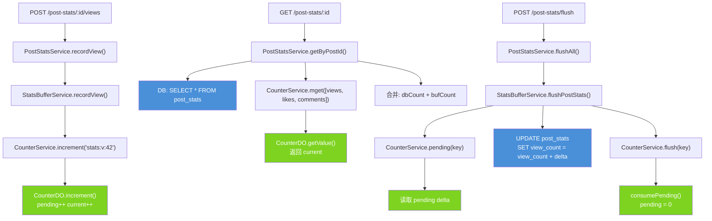

**CounterDO 内部状态：**

```ts
// packages/honest-plugins/counter/src/counter-do.ts
interface CounterState {
  current: number; // 当前展示值（如 100000）
  pending: number; // 待同步增量（如 23）
  lastFlushAt: number;
}
```

**读取时合并（DB + Buffer）：**

```ts
// apps/platform-api/src/modules/post-stats/post-stats.service.ts
async getByPostId(postId: string) {
  const dbStats = await this.db.query.postStats.findFirst({
    where: eq(postStats.postId, postId),
  });
  const buf = await this.buffer.getBufferedStats(postId);

  return {
    viewCount: (dbStats?.viewCount ?? 0) + buf.views,
    likeCount: (dbStats?.likeCount ?? 0) + buf.likes,
    commentCount: (dbStats?.commentCount ?? 0) + buf.comments,
  };
}
```

**Flush 写入 DB：**

```ts
// apps/platform-api/src/modules/post-stats/stats-buffer.service.ts
async flushPostStats(postId: string) {
  const viewsPending = await this.counter.pending(`stats:v:${postId}`);
  const likesPending = await this.counter.pending(`stats:l:${postId}`);
  const commentsPending = await this.counter.pending(`stats:c:${postId}`);

  if (viewsPending === 0 && likesPending === 0 && commentsPending === 0) return;

  const existing = await this.db.query.postStats.findFirst(...);

  if (!existing) {
    await this.db.insert(postStats).values({
      postId, viewCount: viewsPending, likeCount: likesPending, commentCount: commentsPending,
    });
  } else {
    // ✅ 增量更新，不覆盖
    await this.db.update(postStats)
      .set({
        viewCount: sql`view_count + ${viewsPending}`,
        likeCount: sql`like_count + ${likesPending}`,
        commentCount: sql`comment_count + ${commentsPending}`,
      })
      .where(eq(postStats.postId, postId));
  }

  // 消费 pending，重置为 0
  await this.counter.flush(`stats:v:${postId}`);
  await this.counter.flush(`stats:l:${postId}`);
  await this.counter.flush(`stats:c:${postId}`);
}
```

---

## Pattern 4 实现：Immutable Append Log

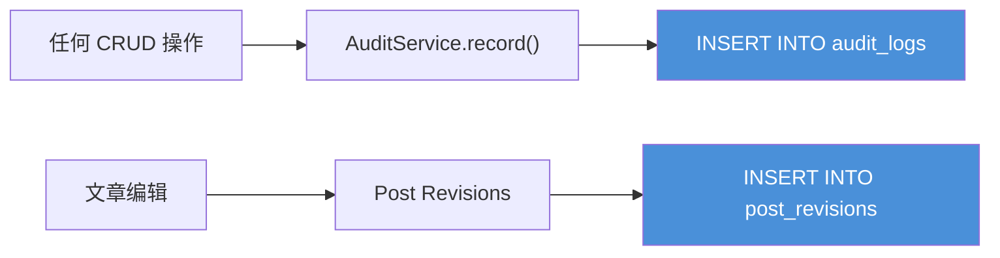

**审计日志 — 只 INSERT，不 UPDATE/DELETE：**

```ts
// apps/platform-api/src/modules/audit/audit.service.ts
async record(input: AuditRecordInput): Promise<AuditLog> {
  const [row] = await this.db.insert(auditLogs).values({
    traceId: input.traceId,
    actorId: input.actorId,
    actorRole: input.actorRole,
    action: input.action,
    targetType: input.targetType,
    targetId: input.targetId,
    status: input.status,
    message: input.message,
    ipAddress: input.ipAddress,
    userAgent: input.userAgent,
    meta: input.meta,
  }).returning();
  return row;
}
```

**文章版本 — 每次编辑生成一条历史记录：**

```ts
// postRevisions 表: postId, contentMd, createdAt, createdBy
// 永远 INSERT，不 UPDATE，形成不可变的编辑历史
```

---

## 种子数据与系统初始化

`SystemInitService` 在应用启动时运行，基于 hash 幂等性保证只执行一次：

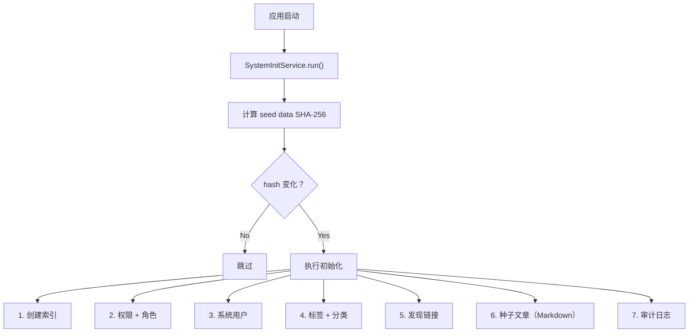

种子文章通过 `gray-matter` 解析 frontmatter，创建 `postCore` + `postContent` + `postStats` 三张表的关联记录。后续通过 `doc_hash` 检测内容变化，跳过未修改的文章。

---

# 9. Failure Recovery（故障恢复）

## DO Flush 失败

- Pending Delta 保留在 DO SQLite 中
- 下次请求或 Alarm 再次重试
- 只有 Primary Database 更新成功后才清零

```ts
async function flush() {
  if (pending === 0) return;
  try {
    await db
      .prepare("UPDATE article_stats SET views = views + ? WHERE id = ?")
      .bind(pending, articleId)
      .run();

    pending = 0; // 仅成功后清零
    await storage.put("pending", 0);
  } catch (err) {
    // 保留 pending，等待下次重试
    console.error("flush failed", err);
  }
}
```

## KV 与 Primary Database 不一致

- 以 Primary Database 为准
- 后台任务可定期重新生成 KV
- 文章更新采用版本号覆盖写入

## 冷启动恢复

DO 启动时：`Primary Database 基础值 + DO Pending Delta = 当前展示值`

---

# 10. Anti-Patterns（反模式）

## ❌ 将统计直接写入 KV

```ts
const article = await KV.get(key, "json");
article.views++;
await KV.put(key, JSON.stringify(article));
```

**问题：**

- 同一个 Key 每秒只能有限写入
- 存在竞争覆盖
- 全球最终一致性导致计数不准确

**正确方式：** 使用 DO Counter Aggregation。

## ❌ 将评论存为一个 KV JSON 数组

```ts
comments.push(newComment);
await KV.put("comments:hello", JSON.stringify(comments));
```

**问题：**

- 数组无限增长
- 每次都要读取整个 JSON
- 无法分页与搜索

**正确方式：** 使用 Pattern 4（Immutable Append Log），评论直接写 Primary Database。

## ❌ 使用绝对值覆盖统计

```ts
UPDATE article_stats SET views = 123456;
```

**问题：** 多实例 flush 时会丢失增量。

**正确方式：**

```ts
UPDATE article_stats SET views = views + :delta;
```

## ❌ 分类/标签放 KV

博客场景下分类 20 个、标签 50 个，查询成本极低，放 Primary Database 即可。只有 KB~MB 级的渲染结果才值得走 KV 缓存。

---

# 11. 未来演进方向

- [ ] Primary Database → PostgreSQL / MySQL
- [ ] KV → Redis / CDN Edge Cache
- [ ] DO → Redis Streams / Kafka / Actor System
- [ ] 增加异步事件总线（Queue）
- [ ] 增加搜索索引（Meilisearch / Typesense）

> 这套设计是可演进的，不是绑定 Cloudflare 的一次性方案。
