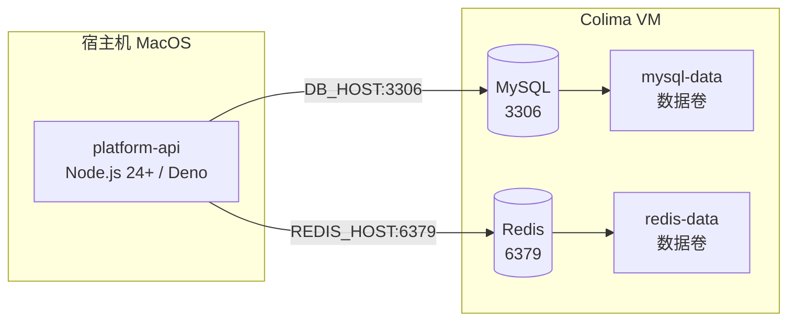

**English** | [中文](./getting-started.zh.md)

# Local development guide

This guide helps you start the whole project in a local environment, including the infrastructure (MySQL, Redis) and the application services.

## Prerequisites

| Tool | Recommended version | Installation |
| -------------- | ---------- | ----------------------------------------------------------------------------------------------------------------------------------------- |
| Docker | Latest stable | Mac: `brew install docker`<br>Windows: [Docker Desktop](https://docs.docker.com/get-started/get-docker/)<br>Linux: system package manager or the official script |
| Docker Compose | Latest stable | Mac: `brew install docker-compose`<br>Windows/Linux: same as above |
| pnpm | >= 9 | `npm install -g pnpm` |
| Node.js | >= 24.14.1 | nvm recommended for version management |
| Bun | Latest | used as the runtime for `platform-api` dev mode |

### Note for Mac without Docker Desktop

Use Colima to provide Docker virtualization:

```bash
brew install colima
colima start --cpu 4 --memory 4 --disk 60
```

Colima works with the Docker CLI automatically, so Docker Desktop is not needed.

### Windows / Linux notes

- **Windows** — Docker Desktop recommended; the PowerShell environment-variable syntax differs, so prefer configuring via a `.env` file
- **Linux** — use the system Docker + Compose; watch out for port conflicts and firewall settings

## Project initialization

### Clone the repo

```bash
git clone <repo-url>
cd <project-directory>
```

### Configure environment variables

Create a `.env` file in the project root:

```env
# MySQL
DB_HOST=localhost
DB_PORT=3306
DB_USER=root
DB_PASSWORD=root
DB_DATABASE=rx_ted

# Redis
REDIS_HOST=localhost
REDIS_PORT=6379
REDIS_USERNAME=
REDIS_PASSWORD=
```

## Start the infrastructure

### Start the containers

```bash
# Mac: make sure Colima is running first
colima start

# Start MySQL and Redis
docker compose up -d

# Check container status
docker compose ps
```

Wait until the `mysql` and `redis` status becomes `healthy`.

### Connection info

| Service | Host | Port | User | Password | Database |
| ----- | --------- | ---- | ---- | ---- | ------ |
| MySQL | localhost | 3306 | root | root | rx_ted |
| Redis | localhost | 6379 | - | - | - |

The `mysql-data` and `redis-data` volumes persist the MySQL and Redis data respectively.

> If a port is occupied, edit the port mapping in `docker-compose.yml`, e.g. `3307:3306`.

## Install app dependencies

```bash
pnpm install
```

> On Mac M1/M2, make sure Node.js and pnpm are ARM builds to avoid dependency install errors.

## Database migration

```bash
pnpm db push
```

On success, you can confirm the database tables were created with a MySQL client.

## Start the apps

### All apps (recommended for development)

```bash
pnpm dev
```

Dev mode supports hot reload — apps restart automatically when you edit code.

### platform-api only

```bash
pnpm --filter @rx-ted/platform-api dev
```

## Quick start (one-shot)

The following commands set up the entire environment in order:

```bash
# 1. Start Colima
colima start --cpu 4 --memory 4 --disk 60

# 2. Clone the repo
git clone <repo-url>
cd <project-directory>

# 3. Configure environment variables
cp .env.example .env
# edit .env and fill in the MySQL/Redis config

# 4. Start the infrastructure
docker compose up -d

# 5. Install dependencies
pnpm install

# 6. Database migration
pnpm db push

# 7. Start the apps
pnpm dev
```

## Local development architecture



## Common Docker commands

| Action | Command |
| ----------------------- | ------------------------------------------------------ |
| Stop containers | `docker compose stop` |
| Stop and remove containers | `docker compose down` |
| Stop and remove containers + volumes | `docker compose down -v` |
| View all logs | `docker compose logs -f` |
| View MySQL logs | `docker compose logs -f mysql` |
| View Redis logs | `docker compose logs -f redis` |
| Enter the MySQL container | `docker compose exec mysql mysql -uroot -proot rx_ted` |
| Enter the Redis container | `docker compose exec redis redis-cli` |
| Clean up unused images/volumes | `docker system prune -a && docker volume prune` |

## Troubleshooting

### Docker connection fails

```text
Cannot connect to the Docker daemon
```

```bash
colima start
docker context use colima
docker context ls
```

Confirm the `colima` context is marked with `*`.

### MySQL fails to start

```bash
docker compose logs mysql
```

Common causes: port 3306 occupied, a corrupted data volume, or a configuration error. Recreate if necessary:

```bash
docker compose down -v
docker compose up -d
```

### Redis connection fails

```bash
docker compose logs redis
docker compose exec redis redis-cli ping
# should return PONG
```

### Database migration fails

Confirm the MySQL status is `healthy`:

```bash
docker compose ps
docker compose exec mysql mysql -uroot -proot
```

### Managing Colima

```bash
colima status   # view status
colima stop     # stop
colima restart  # restart
```

Reallocate resources when they're insufficient:

```bash
colima stop
colima start --cpu 6 --memory 8 --disk 80
```
