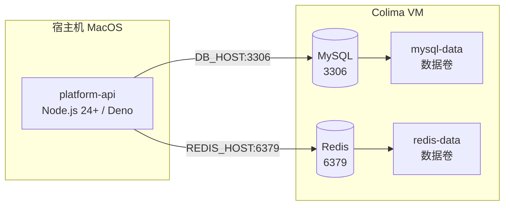

# 本地开发运行指南

本指南帮助你在本地环境启动整个项目，包括基础设施（MySQL、Redis）和应用服务。

## 前置条件

| 工具           | 推荐版本   | 安装说明                                                                                                                                  |
| -------------- | ---------- | ----------------------------------------------------------------------------------------------------------------------------------------- |
| Docker         | 最新稳定版 | Mac: `brew install docker`<br>Windows: [Docker Desktop](https://docs.docker.com/get-started/get-docker/)<br>Linux: 系统包管理器或官方脚本 |
| Docker Compose | 最新稳定版 | Mac: `brew install docker-compose`<br>Windows/Linux: 同上                                                                                 |
| pnpm           | >= 9       | `npm install -g pnpm`                                                                                                                     |
| Node.js        | >= 24.14.1 | 推荐使用 nvm 管理版本                                                                                                                     |
| Bun            | 最新版     | 用于 `platform-api` 开发模式运行时                                                                                                        |

### Mac 无 Docker Desktop 说明

使用 Colima 提供 Docker 虚拟化：

```bash
brew install colima
colima start --cpu 4 --memory 4 --disk 60
```

Colima 自动与 Docker CLI 配合，无需 Docker Desktop。

### Windows / Linux 说明

- **Windows** — 推荐 Docker Desktop，PowerShell 下环境变量语法不同，建议使用 `.env` 文件配置
- **Linux** — 使用系统 Docker + Compose 即可，注意端口冲突和防火墙设置

## 项目初始化

### 克隆项目

```bash
git clone <项目仓库地址>
cd <项目目录>
```

### 配置环境变量

在项目根目录创建 `.env` 文件：

```env
# MySQL
DB_HOST=localhost
DB_PORT=3306
DB_USER=root
DB_PASSWORD=root
DB_DATABASE=rx_ted

# Redis
REDIS_HOST=localhost
REDIS_PORT=6379
REDIS_USERNAME=
REDIS_PASSWORD=
```

## 启动基础设施

### 启动容器

```bash
# Mac：先确保 Colima 已启动
colima start

# 启动 MySQL 和 Redis
docker compose up -d

# 查看容器状态
docker compose ps
```

等待 `mysql` 和 `redis` 状态变为 `healthy`。

### 连接信息

| 服务  | 主机      | 端口 | 用户 | 密码 | 数据库 |
| ----- | --------- | ---- | ---- | ---- | ------ |
| MySQL | localhost | 3306 | root | root | rx_ted |
| Redis | localhost | 6379 | -    | -    | -      |

数据卷：`mysql-data`、`redis-data` 分别持久化 MySQL 和 Redis 数据。

> 端口被占用时，可修改 `docker-compose.yml` 中的端口映射，例如 `3307:3306`。

## 安装应用依赖

```bash
pnpm install
```

> Mac M1/M2 用户请确保 Node.js 与 pnpm 为 ARM 版本，避免安装依赖报错。

## 数据库迁移

```bash
pnpm db push
```

成功后可用 MySQL 客户端确认数据库表已生成。

## 启动应用

### 全部应用（推荐开发模式）

```bash
pnpm dev
```

开发模式支持热重载，修改代码后自动重启。

### 仅 platform-api

```bash
pnpm --filter @rx-ted/platform-api dev
```

## 快速开始（一键执行）

以下命令按顺序完成全部环境搭建：

```bash
# 1. 启动 Colima
colima start --cpu 4 --memory 4 --disk 60

# 2. 克隆项目
git clone <项目仓库地址>
cd <项目目录>

# 3. 配置环境变量
cp .env.example .env
# 编辑 .env 填入 MySQL/Redis 配置

# 4. 启动基础设施
docker compose up -d

# 5. 安装依赖
pnpm install

# 6. 数据库迁移
pnpm db push

# 7. 启动应用
pnpm dev
```

## 本地开发架构



## Docker 常用命令

| 操作                    | 命令                                                   |
| ----------------------- | ------------------------------------------------------ |
| 停止容器                | `docker compose stop`                                  |
| 停止并删除容器          | `docker compose down`                                  |
| 停止并删除容器 + 数据卷 | `docker compose down -v`                               |
| 查看所有日志            | `docker compose logs -f`                               |
| 查看 MySQL 日志         | `docker compose logs -f mysql`                         |
| 查看 Redis 日志         | `docker compose logs -f redis`                         |
| 进入 MySQL 容器         | `docker compose exec mysql mysql -uroot -proot rx_ted` |
| 进入 Redis 容器         | `docker compose exec redis redis-cli`                  |
| 清理未使用的镜像/卷     | `docker system prune -a && docker volume prune`        |

## 故障排查

### Docker 无法连接

```text
Cannot connect to the Docker daemon
```

```bash
colima start
docker context use colima
docker context ls
```

确认 `colima` 上下文旁有 `*` 标记。

### MySQL 启动失败

```bash
docker compose logs mysql
```

常见原因：3306 端口被占用、数据卷损坏、配置错误。必要时重建：

```bash
docker compose down -v
docker compose up -d
```

### Redis 无法连接

```bash
docker compose logs redis
docker compose exec redis redis-cli ping
# 正常返回 PONG
```

### 数据库迁移失败

确认 MySQL 状态是否为 `healthy`：

```bash
docker compose ps
docker compose exec mysql mysql -uroot -proot
```

### Colima 管理

```bash
colima status   # 查看状态
colima stop     # 停止
colima restart  # 重启
```

资源不足时重新分配：

```bash
colima stop
colima start --cpu 6 --memory 8 --disk 80
```
