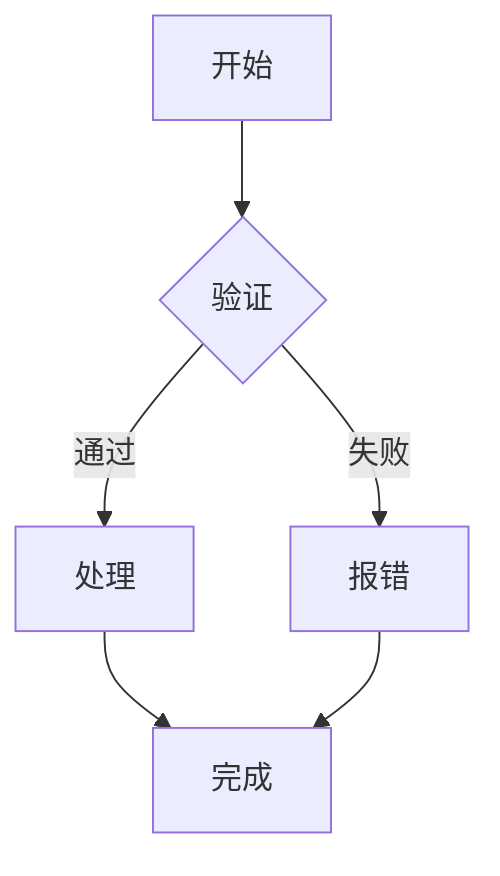

# Markdown 编辑器与渲染

> 本文整合了原先分散的若干文档：
>
> - **Markdown语法参考**
> - **渲染管线**
> - **源码映射 SourceMap**
> - **滚动同步**
>
> 这四块共同构成 `apps/web-blog` 编辑器的完整体系：**语法 → 渲染 → 映射 → 同步**。

## 设计目标

- Editor 与 Viewer 完全解耦，通过 `SyncEngine` 通信
- 不依赖 Markdown，可扩展到 MDX / 富文本
- 支持大型文档（数万节点）
- 支持 TOC、评论、搜索、折叠、代码组等功能
- **Scroll Sync 只是 SourceMap 的一个应用**

---

## Markdown 语法参考

本文档按章节组织，每节先介绍**语法**，再给出**演示效果**。

### 1. 标题

语法：`#` 到 `######` 表示一至六级标题。

## 标题 1

### 标题 2

#### 标题 3

##### 标题 4

###### 标题 5

###### 标题 6

### 2. 文字样式

语法：`**加粗**`、`*斜体*`、`~~删除线~~`，行内代码用反引号包裹。

| 样式     | 语法              | 效果               |
| -------- | ----------------- | ------------------ |
| 加粗     | `**文字**`        | **文字**           |
| 斜体     | `*文字*`          | _文字_             |
| 加粗斜体 | `***文字***`      | **_文字_**         |
| 删除线   | `~~文字~~`        | ~~文字~~           |
| 行内代码 | `code`            | `code`             |
| 上标     | `<sup>文字</sup>` | E = mc<sup>2</sup> |
| 下标     | `<sub>文字</sub>` | H<sub>2</sub>O     |
| 下划线   | `<u>文字</u>`     | <u>下划线</u>      |

软换行：行尾两个空格加回车。

### 3. 列表

#### 无序列表

- 苹果
- 香蕉
  - 车厘子（缩进子项）
  - 黑樱桃

#### 有序列表

1. 第一步
2. 第二步
3. 第三步

#### 任务列表

- [x] 已完成任务
- [ ] 未完成任务
- [ ] 另一个未完成任务

### 4. 引用

语法：行首 `>`。

> 这是一段引用。
>
> > 嵌套引用。
>
> 引用可以包含 **格式** 和 `代码`。

### 5. 链接与图片

[普通链接](https://example.com)

[带标题的链接](https://example.com "示例网站")

自动链接：<https://example.com>


### 6. 代码块

#### 6.1 基础高亮

语法：三个反引号加语言名。自动显示语言徽标与行号，悬停右上角有复制、行号开关、折叠按钮。

```javascript
function fibonacci(n) {
  if (n <= 1) return n;
  return fibonacci(n - 1) + fibonacci(n - 2);
}

console.log(fibonacci(10)); // 55
```

```tsx
import { useState } from "react";

interface Props {
  name: string;
  age?: number;
}

function Greeting({ name, age }: Props) {
  const [count, setCount] = useState(0);
  return (
    <div>
      <h1>Hello, {name}!</h1>
      {age && <p>Age: {age}</p>}
      <p>Count: {count}</p>
      <button onClick={() => setCount((c) => c + 1)}>+</button>
    </div>
  );
}
```

```css
.container {
  display: grid;
  grid-template-columns: repeat(auto-fill, minmax(300px, 1fr));
  gap: 1.5rem;
  padding: 2rem;
  background: linear-gradient(135deg, #667eea 0%, #764ba2 100%);
}

.card {
  border-radius: 12px;
  box-shadow: 0 4px 6px rgba(0, 0, 0, 0.1);
  transition: transform 0.2s ease;
}

.card:hover {
  transform: translateY(-4px);
}
```

#### 6.2 行高亮

语法：代码块后加 `{行号}`，支持单个、逗号分隔和范围，如 `{1,6,10-20}`。

```javascript {1,3,5-6}
function greet(name) {
  const msg = `Hello, ${name}`;
  const loud = msg.toUpperCase();
  const words = loud.split(" ");
  const parts = words.slice(0, 2);
  return parts.join("!");
}

console.log(greet("world"));
```

#### 6.3 Diff 高亮

语法一（推荐）：行尾加 `// [!code ++]` / `// [!code --]` 注释标记。标记会被剥离，代码保持合法，行号与代码之间显示 `+`/`-`。

```javascript
const count = 1; // [!code --]
const count = 2; // [!code ++]
const enabled = true;
```

也支持 `#`（shell/python）与 `<!-- -->`（HTML）注释风格：

```bash
echo "old" # [!code --]
echo "new" # [!code ++]
```

语法二：`diff` 语言，`+`/`-` 前缀行，前缀同样会移到行号旁：

```diff
- const count = 1;
+ const count = 2;
  const enabled = true;
```

#### 6.4 代码分组

语法：`:::code-group` 容器，内部代码块用 `[标签名]` 标注，顶部出现可切换的标签栏。

:::code-group

```javascript [javascript]
import express from "express";

const app = express();

app.get("/api/users", async (req, res) => {
  const users = await db.users.findAll();
  res.json(users);
});

app.listen(3000, () => {
  console.log("Server running on port 3000");
});
```

```python [python]
from flask import Flask, jsonify

app = Flask(__name__)

@app.route('/api/users')
def get_users():
    users = User.query.all()
    return jsonify([u.to_dict() for u in users])
```

```go [go]
package main

import (
	"encoding/json"
	"net/http"
)

type User struct {
	ID   int    `json:"id"`
	Name string `json:"name"`
}

func usersHandler(w http.ResponseWriter, r *http.Request) {
	users := []User{{1, "Alice"}, {2, "Bob"}}
	json.NewEncoder(w).Encode(users)
}

func main() {
	http.HandleFunc("/api/users", usersHandler)
	http.ListenAndServe(":8080", nil)
}
```

:::

#### 6.5 单标签代码块（显示标题）

语法：`[标签名]` 不放进 `:::code-group` 时，显示为代码块标题。

```rust [Rust 示例]
fn main() {
    let msg = "Hello, World!";
    println!("{}", msg);
}
```

### 7. 表格

语法：`| 列 | 列 |`，对齐方式 `:---` 左对齐、`:---:` 居中、`---:` 右对齐。

| 名称 | 价格  | 库存 | 备注     |
| ---- | ----- | ---- | -------- |
| 苹果 | ¥5.0  | 100  | 新鲜到货 |
| 香蕉 | ¥3.5  | 50   | 促销中   |
| 樱桃 | ¥15.0 | 20   | 进口     |
| 榴莲 | ¥25.0 | 5    | 限量     |

右对齐示例：

| 左对齐 | 居中 | 右对齐 |
| :----- | :--: | -----: |
| 左     |  中  |     右 |
| 文本   | 文本 |   文本 |

### 8. 数学公式（KaTeX）

行内公式：$E = mc^2$

行内公式：$\sum_{i=1}^{n} i = \frac{n(n+1)}{2}$

块级公式：

$$
\int_{-\infty}^{\infty} e^{-x^2} \, dx = \sqrt{\pi}
$$

$$
\begin{bmatrix}
1 & 0 & 0 \\
0 & 1 & 0 \\
0 & 0 & 1
\end{bmatrix}
$$

### 9. 特殊容器（directives）

语法：`:::` 围栏 + 容器名。

:::tip
这是一条提示信息。
:::

:::warning
这是一条警告信息。
:::

:::danger
这是一条危险信息。
:::

:::info
这是一条信息容器。
:::

#### 折叠详情

语法：HTML `<details>` + `<summary>`。

<details>
<summary>点击展开</summary>

这是折叠内容中的 markdown，但是需要 rehype-raw 配合使用。

</details>

> 注意：`remark-directive@4` 不支持 `:::` 嵌套闭合（连续 `:::` 闭合栅栏）。嵌套应使用 HTML `<details>` + 内部指令方式。

<details class="directive directive-details">
<summary>点击查看详情</summary>

这是折叠内容。

:::warning
内部还有警告。
:::

</details>

### 10. HTML 原始内容

语法：直接书写 HTML，经 rehype-raw 渲染。

<p style="color: var(--app-primary);">这是 HTML 渲染的段落。</p>

### 11. Mermaid 图表

语法：```mermaid 代码块。



### 12. 自动标题锚点

每个标题都会自动生成锚点链接（`rehype-autolink-headings`），鼠标悬停可以看到链接图标。

### 13. 综合示例

#### 文章布局示例

> **摘要：** 本文展示了多种 Markdown 语法特性的组合使用。

| 特性      | 支持情况 | 备注                               |
| --------- | -------- | ---------------------------------- |
| 语法高亮  | ✅       | rehype-pretty-code                 |
| 行高亮    | ✅       | `{1,6,10-20}` 语法                 |
| Diff 高亮 | ✅       | `// [!code ++]` 尾标或 `diff` 语言 |
| 代码分组  | ✅       | `:::code-group` 显式分组           |
| 行号      | ✅       | 自动添加                           |
| 数学公式  | ✅       | KaTeX                              |
| 任务列表  | ✅       | GFM                                |
| 目录锚点  | ✅       | 自动生成                           |

:::code-group

```bash [pnpm]
pnpm add hono
```

```bash [npm]
npm install hono
```

```bash [yarn]
yarn add hono
```

```bash [bun]
bun add hono
```

:::

数学与代码结合：

$$
F(n) = \begin{cases}
0 & n = 0 \\
1 & n = 1 \\
F(n-1) + F(n-2) & n > 1
\end{cases}
$$

```javascript
function fib(n) {
  if (n < 2) return n;
  let a = 0,
    b = 1;
  for (let i = 2; i <= n; i++) {
    [a, b] = [b, a + b];
  }
  return b;
}

// 输出前 20 项
console.log(Array.from({ length: 20 }, (_, i) => fib(i)));
// → [0, 1, 1, 2, 3, 5, 8, 13, 21, 34, 55, 89, 144, 233, 377, 610, 987, 1597, 2584, 4181]
```

---

## 渲染管线

### 管线顺序

`apps/web-blog` 使用 unified/remark/rehype 管线 + shiki 高亮。完整链路由 `MarkdownRenderer.vue` 维护：

```javascript
unified()
  .use(remarkParse) // Markdown → mdast
  .use(remarkDirective) // :::container / ::leaf / :text 解析
  .use(remarkDirectiveHandler) // directives → div.directive-* / details
  .use(remarkCodeLabel) // [标签] → data-code-label
  .use(remarkSourceMap) // 生成 SourceNode + data-node
  .use(remarkGfm) // 表格 / 任务列表 / 删除线
  .use(remarkMath) // 数学公式 AST
  .use(remarkRehype, { allowDangerousHtml: true })
  .use(rehypeCaptureCodeMeta) // 捕获代码块 meta（标签/行号）
  .use(rehypeRaw) // 内联 HTML（会剥离 code.data，故 meta 提前捕获）
  .use(rehypeDetailsHeading)
  .use(rehypeMermaid) // mermaid 代码块 → 图表
  .use(rehypePrettyCode) // Shiki 高亮
  .use(rehypeCodeData)
  .use(rehypeLineHighlight) // {1,3,5-6} 行高亮
  .use(rehypeCodeGroup) // :::code-group 显式分组
  .use(rehypeRestoreCodeBlocks)
  .use(rehypeDiffMark) // diff 语言 +/- 前缀 → gutter 标记
  .use(rehypeNotationDiff) // // [!code ++/--] 尾标 → gutter 标记
  .use(rehypeKatex) // KaTeX 渲染
  .use(rehypeSlug) // 标题 id
  .use(rehypeAutolinkHeadings) // 标题锚点链接
  .use(rehypeStringify); // hast → HTML
```

### 依赖表

| Package                       | 用途                                |
| ----------------------------- | ----------------------------------- |
| `unified`                     | Pipeline 核心                       |
| `remark-parse`                | Markdown → mdast                    |
| `remark-gfm`                  | 表格 / 任务列表 / 删除线            |
| `remark-math`                 | 数学公式 AST                        |
| `remark-directive`            | `:::tip` / `:::code-group` 扩展容器 |
| `remark-rehype`               | mdast → hast                        |
| `rehype-raw`                  | 内联 HTML（仅可信来源启用）         |
| `rehype-katex`                | KaTeX 渲染（配套 `remark-math`）    |
| `rehype-pretty-code`          | Shiki 高亮                          |
| `@rehype-pretty/transformers` | 复制 / 行号等 transformer           |
| `rehype-slug`                 | 标题 id                             |
| `rehype-autolink-headings`    | 标题锚点链接                        |
| `rehype-stringify`            | hast → HTML                         |
| `shiki`                       | VS Code 高亮引擎                    |
| `unist-util-visit`            | AST 遍历（自定义插件）              |
| `mdast-util-to-string`        | 提取标题文本（HeadingTree / TOC）   |
| `mermaid`                     | 图表渲染（运行时）                  |

### 代码块增强

自定义插件集中在 `src/utils/rehypeCodeGroup.ts`：

| 插件                      | 职责                                            |
| ------------------------- | ----------------------------------------------- |
| `remarkCodeLabel`         | `[标签]` → `data-code-label`                    |
| `rehypeCaptureCodeMeta`   | 在 `rehypeRaw` 之前捕获 meta（标签 / 行号范围） |
| `rehypeLineHighlight`     | `{1,3,5-6}` 行高亮                              |
| `rehypeCodeGroup`         | `:::code-group` 显式分组（不自动合并）          |
| `rehypeRestoreCodeBlocks` | 解包独立标签 / 高亮块，恢复标题                 |
| `rehypeDiffMark`          | `diff` 语言 `+`/`-` 前缀 → gutter 标记          |
| `rehypeNotationDiff`      | `// [!code ++/--]` 尾标 → gutter 标记           |

关键约束：

- **`rehypeRaw` 会剥离 `code.data`**，因此代码块的 meta 必须在它之前由 `rehypeCaptureCodeMeta` 存入包装元素（`data-code-label` / `data-code-lines`）。
- **rehype-pretty-code 同时高亮行内代码**，diff 类插件需用 `parent?.tagName !== 'pre'` 守卫只处理块级代码。
- diff 的 `+`/`-` 标记放在**行号与代码之间的 gutter**，且每一行都占等宽标记列，保证代码列垂直对齐。

---

## 源码映射（SourceMap）

### 架构

Markdown Source Map 建立 **Markdown AST ↔ HTML DOM** 的映射关系，是编辑器中滚动同步、目录高亮、搜索定位、评论锚点、错误提示、编辑器定位、实时协同编辑等功能的共同基础设施。

```
Markdown source
      │
  remarkParse (MDAST + .position)
      │
  remarkSourceMap (分配 node.id, 注入 hProperties)
      │
  其他 remark 插件
      │
  remarkRehype (hProperties → hAST 属性)
      │
  其他 rehype 插件 → rehypeStringify
      │
  HTML (data-node, data-start, data-end)
      │
  MarkdownIndex.fromDOM (构建 elements 索引)
      │
  MarkdownIndex (内存中的双向查找表)
```

核心原则：**DOM 只负责渲染，不存业务数据**。DOM 元素仅携带轻量级 `data-node` ID 和行列号属性，所有偏移量和索引在 `MarkdownIndex` 内存中维护。

### 数据结构

#### SourceNode

```ts
interface SourceNode {
  id: number; // 唯一节点 ID（连续整数）
  kind: NodeKind; // 节点类型
  startLine: number; // 起始行号（1-indexed）
  endLine: number; // 结束行号（1-indexed）
  startOffset: number; // 起始字符偏移（0-indexed）
  endOffset: number; // 结束字符偏移（0-indexed）
  depth?: number; // heading 才有
  parentId?: number; // 父节点 ID
  children?: number[]; // 子节点 ID 列表
}
```

由 `remarkSourceMap` remark 插件在解析阶段生成。覆盖的节点类型：

- `paragraph` → `<p>`
- `heading` → `<h1>`–`<h6>`
- `code` → `<pre>`
- `blockquote` → `<blockquote>`
- `list` / `listItem` → `<ul>` / `<ol>` / `<li>`
- `table` → `<table>`
- `thematicBreak` → `<hr>`
- `containerDirective` / `leafDirective` → `<div class="directive-*">` / `<details>`
- `html` → 内联 HTML
- `math` → KaTeX 公式

内联节点（`text`, `emphasis`, `strong`, `inlineCode`, `link`）不生成 SourceNode。

#### HTML 属性

每个 block-level 元素附带：

```html
<h1 data-node="1" data-start="1" data-end="1">标题</h1>
<p data-node="2" data-start="3" data-end="5">段落内容</p>
<pre data-node="3" data-start="7" data-end="12">code</pre>
```

#### MarkdownIndex

```ts
class MarkdownIndex {
  readonly nodes: Map<number, SourceNode>; // id → SourceNode
  readonly elements: Map<number, HTMLElement>; // id → HTMLElement
  readonly lines: SourceNode[]; // 按 startLine 排序
  readonly offsets: SourceNode[]; // 按 startOffset 排序
}
```

##### 查找方法

| 方法                   | 输入                  | 查找路径                      |
| ---------------------- | --------------------- | ----------------------------- |
| `findByLine(line)`     | 行号（1-indexed）     | lines 二分 → node → element   |
| `findByOffset(offset)` | 字符偏移（0-indexed） | offsets 二分 → node → element |
| `findByNodeId(id)`     | 节点 ID               | nodes.get(id) → element       |
| `findByElement(el)`    | HTMLElement           | data-node → nodes.get(id)     |

`findByLine` / `findByOffset` 返回 **最小包含块**（不是第一个匹配）。全部返回 `{ node: SourceNode; element?: HTMLElement } | undefined`。

### 应用场景

#### 编辑器 ↔ 预览滚动同步（当前）

- **Editor → Preview**：光标 offset → `findByOffset(offset)` → `element.scrollIntoView()`
- **Preview → Editor**：viewport 顶部最近的 `[data-node]` → `findByElement(el)` → `startLine` → 编辑器滚动

#### 目录高亮

遍历 `<h1>`–`<h6>` 的 `data-node`，配合 `IntersectionObserver` 或 scroll 事件，判断当前阅读位置对应的标题，高亮目录中的对应项。

#### 搜索定位

搜索匹配到源文本中的 offset → `findByOffset(offset)` → 滚动到对应元素。

#### 评论锚点

在 SourceNode 级别存储锚点（存 `node.id`），渲染时高亮对应 `[data-node]` 元素，不受文本后续修改的影响（只要该 block 未被删除）。

#### 错误提示

服务端或校验器返回错误行号 → `findByLine(line)` → 高亮 / 滚动到对应元素。

#### 编辑器定位

从 URL hash 或外部导航拿到 `data-node` ID → `findByNodeId(id)` → 编辑器滚动到对应 startLine。

#### 实时协同编辑

远程操作用户的 offset → `findByOffset(offset)` → 本地定位到对应元素位置。

### 插件化设计

当前实现在 `apps/web-blog/src/utils/` 下：

- `sourcemap.ts` — 核心类型和 `MarkdownIndex`
- `remarkSourceMap.ts` — remark 插件

这些模块与具体组件解耦，未来可提取为独立 npm 包，供其他项目复用。

---

## 滚动同步（Scroll Sync）

基于 **SourceMap + MarkdownIndex + DomIndex + SyncEngine** 的双向同步方案。

### 架构图

```
                  Markdown
                      │
              remark-parse
                      │
                   mdast
                      │
           remarkSourceMap
                      │
         生成 SourceNode[] + data-node 属性
                      │
              remark-rehype → rehype-stringify
                      │
                HTML(data-node)
                      │
         ┌────────────┴────────────┐
         ▼                         ▼
  MarkdownIndex               DomIndex
   (lines / offsets / id)    (element / position)
         │                         │
         └────────────┬────────────┘
                      ▼
                 SyncEngine
               ↙            ↘
          Editor          Viewer
```

**核心原则**：

- DOM 只保留 `data-node`，不保存行号、偏移等信息
- MarkdownIndex 不依赖浏览器（可 SSR/序列化）
- DomIndex 不保存 Markdown 信息
- Renderer 不参与同步
- Editor 与 Viewer 通过 SyncEngine 通信

### 接口总览

#### SourceNode

见上文「源码映射」章节，`SourceNode` 是**整个系统唯一的数据来源（Single Source of Truth）**。

#### MarkdownIndex

```ts
class MarkdownIndex {
  readonly nodes: Map<number, SourceNode>;
  readonly lines: SourceNode[]; // 按 startLine 排序，同线则按范围升序
  readonly offsets: SourceNode[]; // 按 startOffset 排序

  constructor(sourceNodes: SourceNode[]);

  findByLine(line: number): SourceNode | undefined; // 最小包含块
  findByOffset(offset: number): SourceNode | undefined; // 最小包含块
  findByNodeId(id: number): SourceNode | undefined;
}
```

#### DomIndex

```ts
class DomIndex {
  readonly elements: Map<number, HTMLElement>;
  private sortedPositions: Array<{ id: number; offsetTop: number }>;

  constructor(elements: Map<number, HTMLElement>);

  buildPositions(root: HTMLElement): void; // 初始化 + ResizeObserver
  findClosest(
    scrollTop: number,
  ): { id: number; element: HTMLElement } | undefined;
  getElement(id: number): HTMLElement | undefined;
  destroy(): void;
}
```

`findClosest` 使用二分查找（O(logN)），替代 V1 的 O(N) 全遍历。用 `ResizeObserver` 自动维护 offsetTop。

#### HeadingTree

```ts
interface HeadingNode {
  id: number;
  depth: number;
  parentId?: number;
  children: number[];
}

class HeadingTree {
  readonly byId: Map<number, HeadingNode>;
  readonly roots: HeadingNode[];
  readonly all: HeadingNode[];

  constructor(nodes: SourceNode[]);
  getById(id: number): HeadingNode | undefined;
  getPath(id: number): HeadingNode[]; // 从根到当前节点的路径
}
```

#### SyncEngine

```ts
enum SyncReason {
  None = 0,
  Render,
  Editor,
  Preview,
  Navigation,
  Follow,
}

interface SyncConfig {
  textarea: HTMLTextAreaElement;
  previewScroll: HTMLElement;
  markdownIndex: MarkdownIndex;
  domIndex: DomIndex;
  isTyping: () => boolean;
}

class SyncEngine {
  reason: SyncReason;

  get isSyncing(): boolean; // reason !== None
  get currentReason(): SyncReason;

  setConfig(cfg: SyncConfig): void;

  follow(line: number): void; // 比例跟随（基于行）
  followByOffset(offset: number): void; // 比例跟随（基于偏移）
  navigate(nodeId: number): void; // scrollIntoView
  editorScroll(line: number): void; // 编辑器滚动→预览同步
  editorClick(offset: number): void; // 编辑器点击→预览定位
  previewScroll(): void; // 预览滚动→编辑器同步
}
```

### 四种同步模式

| 模式              | 用途                            | 算法                                                                                |
| ----------------- | ------------------------------- | ----------------------------------------------------------------------------------- |
| **Navigation**    | TOC / Search / Comment / Anchor | `scrollIntoView({ block: 'start' })`                                                |
| **Follow**        | 输入 / 删除 / Enter             | **比例滚动**：`ratio = (pos-start)/(end-start)`, `scrollTop = elTop + height*ratio` |
| **EditorScroll**  | 用户滚动编辑器                  | `findByLine → scrollIntoView`                                                       |
| **PreviewScroll** | 用户滚动预览                    | `DomIndex.findClosest → 编辑器 scrollTop 设置`                                      |

### 守卫矩阵

```
                编辑器 scroll    预览 scroll    编辑器 click
syncReason!=None  阻断             阻断            阻断
isTyping=true     阻断             阻断            不阻断（有意操作）
```

`SyncReason` 取代 V1 的单布尔 `syncing`，提供可调试的同步原因。

### 事件流程

```
用户输入
  │
  @input → onInput(v)
  │  ├── isTyping = true, 重置 500ms 定时器
  │  └── emitValue(v) → currentValue → emit('update:modelValue')
  │
  MarkdownRenderer.render() (async)
  │
  html.value 更新 → watch(html, async)
  │  ├── await nextTick()
  │  ├── addCodeInteractions()
  │  ├── await initMermaid()
  │  └── emit('ready', { nodes, rootEl })
  │
  onReady(payload)
     ├── 构建 MarkdownIndex (从 nodes)
     ├── 构建 DomIndex (从 rootEl [data-node])
     │   └── DomIndex.buildPositions() + ResizeObserver
     ├── SyncEngine.setConfig()
     ├── syncEngine.reason = SyncReason.Render
     ├── if isTyping && isEditorNearEnd
     │   └── preview.scrollTop = scrollHeight (一滚到底)
     ├── else if isTyping
     │   └── syncEngine.followByOffset(selectionStart) (比例跟随)
     └── rAF → syncEngine.reason = SyncReason.None
```

反向：

```
Preview Scroll
      ↓
   SyncEngine
      ↓
    Editor
```

### 比例跟随算法（Follow）

V1 用 `findNode() → scrollIntoView()`，Enter 时 viewer 跳回段落顶部。

V2 改为比例滚动：

```
光标在段落的 line=40，段落范围 20~60
ratio = (40-20) / (60-20) = 0.5
DOM 元素高度 800px
viewer.scrollTop = el.offsetTop + 800 * 0.5 - 容器高度 * 0.15
```

Enter 时 viewer 只移动几像素，不会跳回段落顶部。

### Preview → Editor 优化

V1：遍历全部 elements Map 计算 `getBoundingClientRect()` — O(N)

V2：`DomIndex.findClosest(scrollTop)` — 二分查找 O(logN)

`DomIndex.sortedPositions` 由 `ResizeObserver` 自动维护。

### Renderer 生命周期

```
Render → HTML → nextTick → CodeGroup → Mermaid → Math → DOM Ready
                                                          ↓
                                              DomIndex.buildPositions()
                                                          ↓
                                              emit('ready')
```

SyncEngine 永远等待 `DOM Ready`，Mermaid/Tabs 等异步渲染不影响同步。

### NodeID 方案

**连续整数**（V2），不编码层级关系：

````
1: # 标题一
2: ## 标题一.1
3: 段落文本
4: ```代码块```
5: ## 标题一.2
````

层级关系通过 `parentId / children` 在 `SourceNode` 中独立维护。

### 职责划分

| 模块              | 职责                           |
| ----------------- | ------------------------------ |
| `remarkSourceMap` | 生成 SourceNode 与 data-node   |
| `MarkdownIndex`   | 文档索引（Line / Offset / ID） |
| `DomIndex`        | DOM 元素与位置索引             |
| `HeadingTree`     | Heading 层级关系               |
| `SyncEngine`      | 双向同步算法                   |
| `Renderer`        | Markdown → HTML 渲染           |
| `Editor`          | 文本编辑                       |
| `Viewer`          | HTML 展示                      |

### 文件结构

| 文件                           | 职责                                         |
| ------------------------------ | -------------------------------------------- |
| `src/utils/sourcemap.ts`       | `SourceNode`, `MarkdownIndex`, `HeadingTree` |
| `src/utils/domIndex.ts`        | `DomIndex`                                   |
| `src/utils/syncEngine.ts`      | `SyncEngine`, `SyncReason`                   |
| `src/utils/remarkSourceMap.ts` | Remark 插件（生成 SourceNode + data-node）   |
| `MarkdownRenderer.vue`         | 渲染管道，emit `ready`                       |
| `MarkdownEditor.vue`            | 消费方，组合所有模块                         |

### 设计原则

1. **MarkdownIndex 不依赖浏览器** — 可 SSR、可缓存、可序列化
2. **DomIndex 不保存 Markdown 信息** — 只负责 DOM 位置
3. **Renderer 不参与同步**
4. **Editor 与 Viewer 永远通过 SyncEngine 通信**
5. **DOM 只保留 `data-node`**，不保存 Line、Offset 等重复信息
6. **NodeID 使用连续整数，层级关系独立维护**
7. **导航（Navigation）与编辑跟随（Follow）采用不同同步算法**
8. **Scroll Sync 是 SourceMap 的一个应用，不是 SourceMap 本身**

该架构不仅适用于 Markdown，也适用于任何能够生成 `SourceNode + data-node` 的文档系统，因此具有较好的可扩展性和长期维护性。

### 未来扩展

由于 SourceMap 统一维护 NodeID，以下功能全部直接引用 NodeID：

- TOC
- Comments
- Search
- CodeGroup
- Fold
- Annotation
- Selection
- Error Marker
- AI Review
