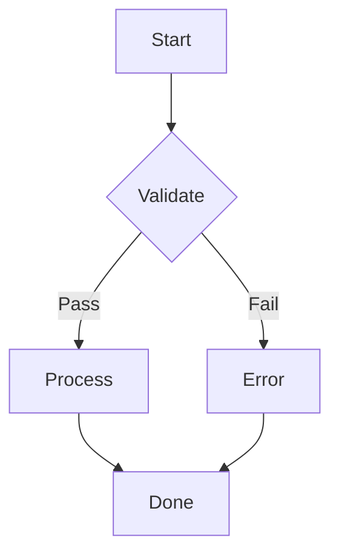

**English** | [中文](./markdown-syntax.zh.md)

# Markdown Syntax Reference

A quick reference for the Markdown syntax rendered and supported by `@rx-ted/packages-markdown-editor`. This document is organized by section; each section first introduces the **syntax**, then shows the **rendered result**.

### 1. Headings

Syntax: `#` through `######` denote first- to sixth-level headings.

## Heading 1

### Heading 2

#### Heading 3

##### Heading 4

###### Heading 5

###### Heading 6

### 2. Text Styles

Syntax: `**bold**`, `*italic*`, `~~strikethrough~~`, inline code is wrapped in backticks.

| Style      | Syntax             | Result             |
| ---------- | ------------------ | ------------------ |
| Bold       | `**text**`         | **text**           |
| Italic     | `*text*`           | _text_             |
| Bold italic | `***text***`       | **_text_**         |
| Strikethrough | `~~text~~`      | ~~text~~           |
| Inline code | `code`            | `code`             |
| Superscript | `<sup>text</sup>` | E = mc<sup>2</sup> |
| Subscript  | `<sub>text</sub>`  | H<sub>2</sub>O     |
| Underline  | `<u>text</u>`      | <u>underline</u>   |

Soft line break: two spaces at the end of a line followed by a newline.

### 3. Lists

#### Unordered List

- Apple
- Banana
  - Cherry (indented sub-item)
  - Black cherry

#### Ordered List

1. First step
2. Second step
3. Third step

#### Task List

- [x] Completed task
- [ ] Incomplete task
- [ ] Another incomplete task

### 4. Blockquotes

Syntax: `>` at the start of a line.

> This is a blockquote.
>
> > Nested blockquote.
>
> Blockquotes can contain **formatting** and `code`.

### 5. Links and Images

[Regular link](https://example.com)

[Link with title](https://example.com "Example Site")

Autolink: <https://example.com>


### 6. Code Blocks

#### 6.1 Basic Highlighting

Syntax: three backticks plus the language name. A language badge and line numbers are shown automatically; hovering over the top-right corner reveals copy, line number toggle, and collapse buttons.

```javascript
function fibonacci(n) {
  if (n <= 1) return n;
  return fibonacci(n - 1) + fibonacci(n - 2);
}

console.log(fibonacci(10)); // 55
```

```tsx
import { useState } from "react";

interface Props {
  name: string;
  age?: number;
}

function Greeting({ name, age }: Props) {
  const [count, setCount] = useState(0);
  return (
    <div>
      <h1>Hello, {name}!</h1>
      {age && <p>Age: {age}</p>}
      <p>Count: {count}</p>
      <button onClick={() => setCount((c) => c + 1)}>+</button>
    </div>
  );
}
```

```css
.container {
  display: grid;
  grid-template-columns: repeat(auto-fill, minmax(300px, 1fr));
  gap: 1.5rem;
  padding: 2rem;
  background: linear-gradient(135deg, #667eea 0%, #764ba2 100%);
}

.card {
  border-radius: 12px;
  box-shadow: 0 4px 6px rgba(0, 0, 0, 0.1);
  transition: transform 0.2s ease;
}

.card:hover {
  transform: translateY(-4px);
}
```

#### 6.2 Line Highlighting

Syntax: `{line numbers}` after the code block, supporting single lines, comma-separated lists, and ranges, e.g. `{1,6,10-20}`.

```javascript {1,3,5-6}
function greet(name) {
  const msg = `Hello, ${name}`;
  const loud = msg.toUpperCase();
  const words = loud.split(" ");
  const parts = words.slice(0, 2);
  return parts.join("!");
}

console.log(greet("world"));
```

#### 6.3 Diff Highlighting

Syntax 1 (recommended): add `// [!code ++]` / `// [!code --]` comment markers at the end of a line. The markers are stripped, the code stays valid, and `+`/`-` are shown between the line number and the code.

```javascript
const count = 1; // [!code --]
const count = 2; // [!code ++]
const enabled = true;
```

`#` (shell/python) and `<!-- -->` (HTML) comment styles are also supported:

```bash
echo "old" # [!code --]
echo "new" # [!code ++]
```

Syntax 2: the `diff` language, with `+`/`-` prefixed lines; the prefixes are also moved next to the line numbers:

```diff
- const count = 1;
+ const count = 2;
  const enabled = true;
```

#### 6.4 Code Groups

Syntax: `:::code-group` container; internal code blocks are labeled with `[tab name]`, and a switchable tab bar appears at the top.

:::code-group

```javascript [javascript]
import express from "express";

const app = express();

app.get("/api/users", async (req, res) => {
  const users = await db.users.findAll();
  res.json(users);
});

app.listen(3000, () => {
  console.log("Server running on port 3000");
});
```

```python [python]
from flask import Flask, jsonify

app = Flask(__name__)

@app.route('/api/users')
def get_users():
    users = User.query.all()
    return jsonify([u.to_dict() for u in users])
```

```go [go]
package main

import (
	"encoding/json"
	"net/http"
)

type User struct {
	ID   int    `json:"id"`
	Name string `json:"name"`
}

func usersHandler(w http.ResponseWriter, r *http.Request) {
	users := []User{{1, "Alice"}, {2, "Bob"}}
	json.NewEncoder(w).Encode(users)
}

func main() {
	http.HandleFunc("/api/users", usersHandler)
	http.ListenAndServe(":8080", nil)
}
```

:::

#### 6.5 Single-Tab Code Block (showing a title)

Syntax: when `[tab name]` is not placed inside `:::code-group`, it is displayed as the code block title.

```rust [Rust example]
fn main() {
    let msg = "Hello, World!";
    println!("{}", msg);
}
```

### 7. Tables

Syntax: `| column | column |`, alignment is set with `:---` left, `:---:` center, `---:` right.

| Name | Price  | Stock | Notes       |
| ---- | ------ | ----- | ----------- |
| Apple | ¥5.0  | 100   | Fresh stock |
| Banana | ¥3.5 | 50    | On promotion |
| Cherry | ¥15.0 | 20   | Imported    |
| Durian | ¥25.0 | 5    | Limited     |

Right-aligned example:

| Left   | Center | Right |
| :----- | :--:   | -----: |
| left   | center | right |
| text   | text   | text  |

### 8. Math Formulas (KaTeX)

Inline formula: $E = mc^2$

Inline formula: $\sum_{i=1}^{n} i = \frac{n(n+1)}{2}$

Block-level formula:

$$
\int_{-\infty}^{\infty} e^{-x^2} \, dx = \sqrt{\pi}
$$

$$
\begin{bmatrix}
1 & 0 & 0 \\
0 & 1 & 0 \\
0 & 0 & 1
\end{bmatrix}
$$

### 9. Special Containers (directives)

Syntax: `:::` fence + container name.

:::tip
This is a tip.
:::

:::warning
This is a warning.
:::

:::danger
This is a danger message.
:::

:::info
This is an info container.
:::

#### Collapsible Details

Syntax: HTML `<details>` + `<summary>`.

<details>
<summary>Click to expand</summary>

This is markdown inside collapsible content, but it requires rehype-raw to work.

</details>

> Note: `remark-directive@4` does not support nested closing of `:::` containers (consecutive `:::` closing fences). For nesting, use HTML `<details>` combined with inner directives.

<details class="directive directive-details">
<summary>Click to view details</summary>

This is the collapsible content.

:::warning
There is a warning inside too.
:::

</details>

### 10. Raw HTML

Syntax: write HTML directly, rendered via rehype-raw.

<p style="color: var(--app-primary);">This is a paragraph rendered as HTML.</p>

### 11. Mermaid Diagrams

Syntax: a ```mermaid code block.



### 12. Automatic Heading Anchors

Every heading automatically gets an anchor link (`rehype-autolink-headings`); hover to see the link icon.

### 13. Combined Example

#### Article Layout Example

> **Abstract:** This article demonstrates the combined use of multiple Markdown syntax features.

| Feature        | Support | Notes                                |
| -------------- | ------- | ------------------------------------ |
| Syntax highlighting | ✅  | rehype-pretty-code                   |
| Line highlighting | ✅    | `{1,6,10-20}` syntax                 |
| Diff highlighting | ✅    | `// [!code ++]` suffix or `diff` language |
| Code groups    | ✅       | `:::code-group` explicit grouping    |
| Line numbers   | ✅       | Added automatically                  |
| Math formulas  | ✅       | KaTeX                                |
| Task lists     | ✅       | GFM                                  |
| TOC anchors    | ✅       | Generated automatically              |

:::code-group

```bash [pnpm]
pnpm add hono
```

```bash [npm]
npm install hono
```

```bash [yarn]
yarn add hono
```

```bash [bun]
bun add hono
```

:::

Math combined with code:

$$
F(n) = \begin{cases}
0 & n = 0 \\
1 & n = 1 \\
F(n-1) + F(n-2) & n > 1
\end{cases}
$$

```javascript
function fib(n) {
  if (n < 2) return n;
  let a = 0,
    b = 1;
  for (let i = 2; i <= n; i++) {
    [a, b] = [b, a + b];
  }
  return b;
}

// 输出前 20 项
console.log(Array.from({ length: 20 }, (_, i) => fib(i)));
// → [0, 1, 1, 2, 3, 5, 8, 13, 21, 34, 55, 89, 144, 233, 377, 610, 987, 1597, 2584, 4181]
```

---
