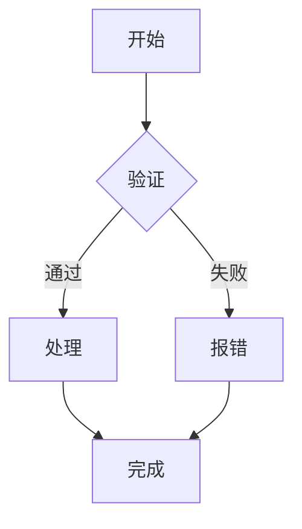

[English](./markdown-syntax.md) | **中文**

# Markdown 语法参考

由 `@rx-ted/packages-markdown-editor` 渲染支持的 Markdown 语法速查，按章节组织，每节先介绍**语法**，再给出**演示效果**。

### 1. 标题

语法：`#` 到 `######` 表示一至六级标题。

## 标题 1

### 标题 2

#### 标题 3

##### 标题 4

###### 标题 5

###### 标题 6

### 2. 文字样式

语法：`**加粗**`、`*斜体*`、`~~删除线~~`，行内代码用反引号包裹。

| 样式     | 语法              | 效果               |
| -------- | ----------------- | ------------------ |
| 加粗     | `**文字**`        | **文字**           |
| 斜体     | `*文字*`          | _文字_             |
| 加粗斜体 | `***文字***`      | **_文字_**         |
| 删除线   | `~~文字~~`        | ~~文字~~           |
| 行内代码 | `code`            | `code`             |
| 上标     | `<sup>文字</sup>` | E = mc<sup>2</sup> |
| 下标     | `<sub>文字</sub>` | H<sub>2</sub>O     |
| 下划线   | `<u>文字</u>`     | <u>下划线</u>      |

软换行：行尾两个空格加回车。

### 3. 列表

#### 无序列表

- 苹果
- 香蕉
  - 车厘子（缩进子项）
  - 黑樱桃

#### 有序列表

1. 第一步
2. 第二步
3. 第三步

#### 任务列表

- [x] 已完成任务
- [ ] 未完成任务
- [ ] 另一个未完成任务

### 4. 引用

语法：行首 `>`。

> 这是一段引用。
>
> > 嵌套引用。
>
> 引用可以包含 **格式** 和 `代码`。

### 5. 链接与图片

[普通链接](https://example.com)

[带标题的链接](https://example.com "示例网站")

自动链接：<https://example.com>


### 6. 代码块

#### 6.1 基础高亮

语法：三个反引号加语言名。自动显示语言徽标与行号，悬停右上角有复制、行号开关、折叠按钮。

```javascript
function fibonacci(n) {
  if (n <= 1) return n;
  return fibonacci(n - 1) + fibonacci(n - 2);
}

console.log(fibonacci(10)); // 55
```

```tsx
import { useState } from "react";

interface Props {
  name: string;
  age?: number;
}

function Greeting({ name, age }: Props) {
  const [count, setCount] = useState(0);
  return (
    <div>
      <h1>Hello, {name}!</h1>
      {age && <p>Age: {age}</p>}
      <p>Count: {count}</p>
      <button onClick={() => setCount((c) => c + 1)}>+</button>
    </div>
  );
}
```

```css
.container {
  display: grid;
  grid-template-columns: repeat(auto-fill, minmax(300px, 1fr));
  gap: 1.5rem;
  padding: 2rem;
  background: linear-gradient(135deg, #667eea 0%, #764ba2 100%);
}

.card {
  border-radius: 12px;
  box-shadow: 0 4px 6px rgba(0, 0, 0, 0.1);
  transition: transform 0.2s ease;
}

.card:hover {
  transform: translateY(-4px);
}
```

#### 6.2 行高亮

语法：代码块后加 `{行号}`，支持单个、逗号分隔和范围，如 `{1,6,10-20}`。

```javascript {1,3,5-6}
function greet(name) {
  const msg = `Hello, ${name}`;
  const loud = msg.toUpperCase();
  const words = loud.split(" ");
  const parts = words.slice(0, 2);
  return parts.join("!");
}

console.log(greet("world"));
```

#### 6.3 Diff 高亮

语法一（推荐）：行尾加 `// [!code ++]` / `// [!code --]` 注释标记。标记会被剥离，代码保持合法，行号与代码之间显示 `+`/`-`。

```javascript
const count = 1; // [!code --]
const count = 2; // [!code ++]
const enabled = true;
```

也支持 `#`（shell/python）与 `<!-- -->`（HTML）注释风格：

```bash
echo "old" # [!code --]
echo "new" # [!code ++]
```

语法二：`diff` 语言，`+`/`-` 前缀行，前缀同样会移到行号旁：

```diff
- const count = 1;
+ const count = 2;
  const enabled = true;
```

#### 6.4 代码分组

语法：`:::code-group` 容器，内部代码块用 `[标签名]` 标注，顶部出现可切换的标签栏。

:::code-group

```javascript [javascript]
import express from "express";

const app = express();

app.get("/api/users", async (req, res) => {
  const users = await db.users.findAll();
  res.json(users);
});

app.listen(3000, () => {
  console.log("Server running on port 3000");
});
```

```python [python]
from flask import Flask, jsonify

app = Flask(__name__)

@app.route('/api/users')
def get_users():
    users = User.query.all()
    return jsonify([u.to_dict() for u in users])
```

```go [go]
package main

import (
	"encoding/json"
	"net/http"
)

type User struct {
	ID   int    `json:"id"`
	Name string `json:"name"`
}

func usersHandler(w http.ResponseWriter, r *http.Request) {
	users := []User{{1, "Alice"}, {2, "Bob"}}
	json.NewEncoder(w).Encode(users)
}

func main() {
	http.HandleFunc("/api/users", usersHandler)
	http.ListenAndServe(":8080", nil)
}
```

:::

#### 6.5 单标签代码块（显示标题）

语法：`[标签名]` 不放进 `:::code-group` 时，显示为代码块标题。

```rust [Rust 示例]
fn main() {
    let msg = "Hello, World!";
    println!("{}", msg);
}
```

### 7. 表格

语法：`| 列 | 列 |`，对齐方式 `:---` 左对齐、`:---:` 居中、`---:` 右对齐。

| 名称 | 价格  | 库存 | 备注     |
| ---- | ----- | ---- | -------- |
| 苹果 | ¥5.0  | 100  | 新鲜到货 |
| 香蕉 | ¥3.5  | 50   | 促销中   |
| 樱桃 | ¥15.0 | 20   | 进口     |
| 榴莲 | ¥25.0 | 5    | 限量     |

右对齐示例：

| 左对齐 | 居中 | 右对齐 |
| :----- | :--: | -----: |
| 左     |  中  |     右 |
| 文本   | 文本 |   文本 |

### 8. 数学公式（KaTeX）

行内公式：$E = mc^2$

行内公式：$\sum_{i=1}^{n} i = \frac{n(n+1)}{2}$

块级公式：

$$
\int_{-\infty}^{\infty} e^{-x^2} \, dx = \sqrt{\pi}
$$

$$
\begin{bmatrix}
1 & 0 & 0 \\
0 & 1 & 0 \\
0 & 0 & 1
\end{bmatrix}
$$

### 9. 特殊容器（directives）

语法：`:::` 围栏 + 容器名。

:::tip
这是一条提示信息。
:::

:::warning
这是一条警告信息。
:::

:::danger
这是一条危险信息。
:::

:::info
这是一条信息容器。
:::

#### 折叠详情

语法：HTML `<details>` + `<summary>`。

<details>
<summary>点击展开</summary>

这是折叠内容中的 markdown，但是需要 rehype-raw 配合使用。

</details>

> 注意：`remark-directive@4` 不支持 `:::` 嵌套闭合（连续 `:::` 闭合栅栏）。嵌套应使用 HTML `<details>` + 内部指令方式。

<details class="directive directive-details">
<summary>点击查看详情</summary>

这是折叠内容。

:::warning
内部还有警告。
:::

</details>

### 10. HTML 原始内容

语法：直接书写 HTML，经 rehype-raw 渲染。

<p style="color: var(--app-primary);">这是 HTML 渲染的段落。</p>

### 11. Mermaid 图表

语法：```mermaid 代码块。



### 12. 自动标题锚点

每个标题都会自动生成锚点链接（`rehype-autolink-headings`），鼠标悬停可以看到链接图标。

### 13. 综合示例

#### 文章布局示例

> **摘要：** 本文展示了多种 Markdown 语法特性的组合使用。

| 特性      | 支持情况 | 备注                               |
| --------- | -------- | ---------------------------------- |
| 语法高亮  | ✅       | rehype-pretty-code                 |
| 行高亮    | ✅       | `{1,6,10-20}` 语法                 |
| Diff 高亮 | ✅       | `// [!code ++]` 尾标或 `diff` 语言 |
| 代码分组  | ✅       | `:::code-group` 显式分组           |
| 行号      | ✅       | 自动添加                           |
| 数学公式  | ✅       | KaTeX                              |
| 任务列表  | ✅       | GFM                                |
| 目录锚点  | ✅       | 自动生成                           |

:::code-group

```bash [pnpm]
pnpm add hono
```

```bash [npm]
npm install hono
```

```bash [yarn]
yarn add hono
```

```bash [bun]
bun add hono
```

:::

数学与代码结合：

$$
F(n) = \begin{cases}
0 & n = 0 \\
1 & n = 1 \\
F(n-1) + F(n-2) & n > 1
\end{cases}
$$

```javascript
function fib(n) {
  if (n < 2) return n;
  let a = 0,
    b = 1;
  for (let i = 2; i <= n; i++) {
    [a, b] = [b, a + b];
  }
  return b;
}

// 输出前 20 项
console.log(Array.from({ length: 20 }, (_, i) => fib(i)));
// → [0, 1, 1, 2, 3, 5, 8, 13, 21, 34, 55, 89, 144, 233, 377, 610, 987, 1597, 2584, 4181]
```

---
